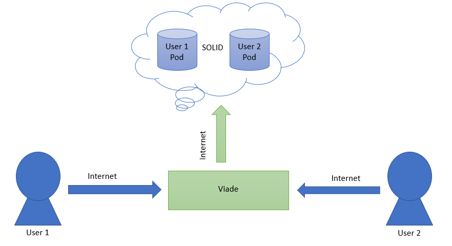

[[section-system-scope-and-context]]
== System Scope and Context

=== Context and scope

Viade is a decentralized route management system.
Viade allows users to share routes with friends or groups of friends.
It also allows you to share photos, videos and other types of files.
It will notify the user when a friend wants to share a route with him.
Viade will allow to show the routes on a map.

=== Business context
Viade is based on the SOLID specification. SOLID (derived from "social linked data") is a proposed set of conventions and tools 
for building decentralized social applications based on Linked Data principles. 
It is a decentralized architecture in which data storage is separated from applications.
Viade users will store the routes in their own PODs. (PODs are like secure USB sticks for the Web, that you can access from anywhere)
Viade will contact Solid POD providers to store the routes and other related information such as photos and videos.
Viade will allow to show the routes on a map using Google Maps.
Viade will allow to see routes generated with other different applications.

image::images/BusinessContext.jpg[Business Context Diagram]

=== Technical Context

The application is a a decentralised web based app, the users will store the data in the solid pods for wich they will need internet acces.
The idea is for users to be able to share routes through urls without the need of a central database in wich to store the data

