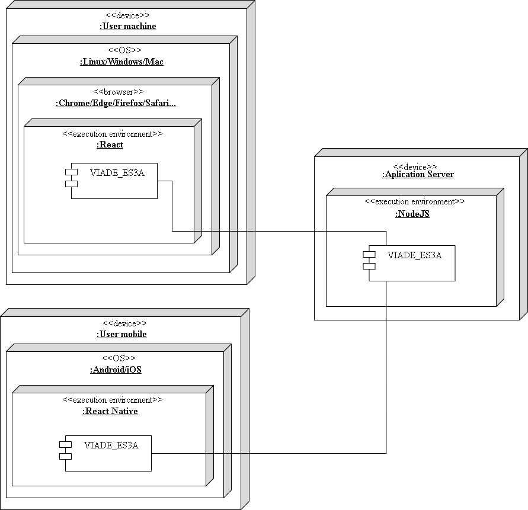

[[section-deployment-view]]

== Deployment View

[options="header"]
|===
| Node / Artifact / Module        | Definition
| Aplication server    | Device that provides services to users' devices. An application server generally manages most (or all) of business logic and access to application data.
| Browser     | A web browser (commonly referred to as a browser) is a software application for accessing information on the Web. For example: Google Chrome, Mozilla Firefox, Internet Explorer, Safari.
| NodeJS     |    Is an open-source JavaScript runtime environment that executes JavaScript code outside of a browser.
| OS     | Operating system (OS) is a system software that manages devices hardware, software resources, and provides common services for users programs.
| React     | A JavaScript library for building user interfaces (also known as React.js or ReactJS). 
| React Native     |   Is an open-source mobile application framework created by Facebook. Enable developers to use React along with native platform capabilities. 
| User machine     | Personal computer owned by the application user. It can be PC or Mac.
| User mobile     |  Mobile device of the user. It can be a mobile phone or a tablet.
| Viade_ES3A     |  A decentralized routes management system based on the Solid specifications. In later versions of the documentation the component architecture will be detailed. 
|===